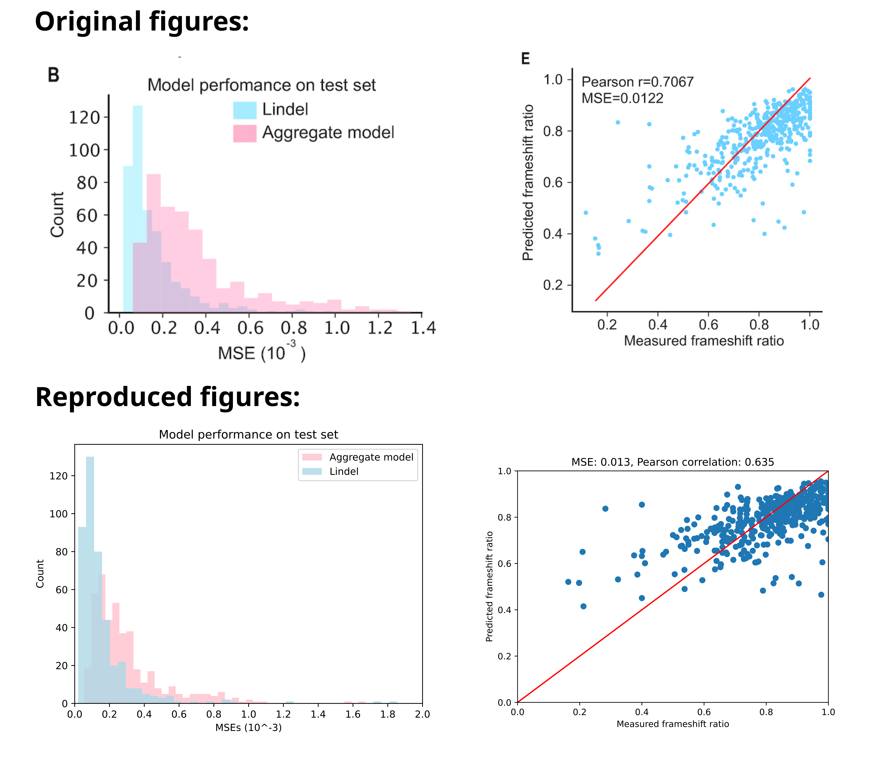

# MLBIO
GitHub repository for the reproduction of figures for the Lindel paper. This was done as part of the course "Machine learning for bioinformatics" (CS4260), at Delft University of technology.

**Students:** Gijs Admiraal, Bianca-Maria Cosma, Ioanna Nika, Connor Schilder.

This project is a reproduction. We extended the code made public in the [Lindel](https://github.com/shendurelab/Lindel) repository, and we credit the following publication:

Wei Chen, Aaron McKenna, Jacob Schreiber, Maximilian Haeussler, Yi Yin, Vikram Agarwal, William Stafford Noble, Jay Shendure, Massively parallel profiling and predictive modeling of the outcomes of CRISPR/Cas9-mediated double-strand break repair, _Nucleic Acids Research_, Volume 47, Issue 15, 05 September 2019, Pages 7989–8003, https://doi.org/10.1093/nar/gkz487

The files used to train the indel, deletion, and insertion logistic regression models can be found in directory `Lindel-data_analysis/scripts/Logistic model training`. We extended `LR_deletion.py` with detailed comments. Since the three files are very similar, we added less detailed documentation to the other two training scripts.

# INSTALL ENVIRONMENT
Environment is given in a yml file. If you do not have this environment installed, run the following command:
`conda env create -f mlbio.yml`

If you do have this environment installed, update it with:
`conda env update --file mlbio.yml --prune`

# REPRODUCTION OF FIGURES
To reproduce figures 6B and 6E from the original paper (shown below), run the following command: `python3 Lindel/plot_6B6E.py`

## Our results

We successfully reproduced figures 6B and 6E from Chen et al., and we corroborate their findings:

# INDIVIDUAL RESEARCH

Each team member conducted individual research and extended the experiments of the original authors. The code can be found in folders named after each student.

## Gijs
I tried to see if for the given Lindel data a better model could be found. The Model i tried was Support Vector Machine (SVM). I tried three different SVM models, each with a different kernel function. These kernel functions were the linear, polynomial and RBF kernel function. Each model can be trained separately using their respective file. To test the model use the 'Test_SVM.py' file, where the specific model can be specified manually.

## Bianca
I investigated the effect of dimensionality reduction on the Lindel deletion model. I applied multiple correspondence analysis (MCA) with various numbers of components and plotted the performance of these smaller models. All of the code can be found and run with the notebook file `mca.ipynb`.

## Ioanna
I replaced logistic regression models with random forest models. This was done to test and identify whether the performance of a non-linear tree-based classifier is better than the performance of the logistic regression model used which is a linear classifier. The relevant scripts and results can be found in `Lindel-data_analysis/scripts/RF_training`. Specifically, `RF_deletion.py` trains a random forest model for the deletion events, `RF_insertion.py` trains a random forest model for the inserion events and `RF_indel.py` rains a random forest model for predicting the indel ratio. The file gen_predictions.py uses all the trained models to make and output predictions. The file plot_predictions.py generates the frameshift and histogram plots given the predictions. The rest of the scripts correspond to ablations and analysis. Specifically, the files that end with `_combined` corresponnd to the ablation where the logistic regression and the random forest models is used. The notebook `analysis_per_class.ipynb` contains the code to plot the MSEs for frameshift annd non frameshift classes. Finally, the folder Ablations contains figures of results when different hyperparameters for the random forest where tested to identify their effect on performance. 

## Connor
I applied a feature selection scheme in Connor/mainlpy. This used Graph.py to construct a graph. In the code for main, I defined how I wanted to select the features with clustering. Because of the reproduction of several figures with several different amounts of features, some of the names I used are commented. Messages are left that mention what these codes are used for. 
The features were embedded in a list to be used for selecting the features in the deletion model. In the deletion model, Connor/LR_deletion, one should add names in order to train the models with the selected weights. This needs to be run in the terminal with the command 'python Connor/LR_deletion.py /data Lindel_training.txt'. Finally, one can run reproduce_figures.py with the correct names set to reproduce the figures. 
A sandbox used to understand the relationship between the features and weigths is found in weights_check.py. 

Using main, LR_deletion and reproduce_figures will allow one to reproduce the figures I created with selected features.
